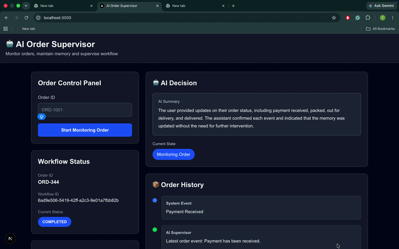

# AI Order Supervisor (Temporal + FastAPI + Next.js)

A workflow-driven AI system that processes and tracks orders using **Temporal orchestration**, a **FastAPI backend**, and a **Next.js dashboard** for real-time monitoring.

The system simulates how AI agents can manage long-running business workflows with memory, event handling, and state tracking.

---

## 🎬 Demo

---

## Features

- Create and track order workflows
- Real-time workflow status updates
- Event-driven processing (`shipment`, `delivery`, etc.)
- AI memory + decision tracking
- Runs history dashboard
- Temporal-based workflow orchestration
- Polling-based real-time UI updates

---

## Tech Stack

**Frontend**
- Next.js (React)
- Tailwind CSS
- Axios

**Backend**
- FastAPI (Python)
- SQLAlchemy

**Workflow Engine**
- Temporal

**Other**
- REST APIs
- PostgreSQL 

---

## 🏗 Architecture
                ┌──────────────────────┐
                │   Next.js Frontend   │
                │  (Dashboard UI)      │
                └─────────┬────────────┘
                          │ REST API 
                          ▼
                ┌──────────────────────┐
                │   FastAPI Backend    │
                │  (API Layer)         │
                └─────────┬────────────┘
                          │ Temporal Client
                          ▼
                ┌──────────────────────┐
                │   Temporal Server    │
                │ (Workflow Engine)    │
                └─────────┬────────────┘                    
              ┌───────────┴────────────┐
              ▼                        ▼
    ┌──────────────────────┐   ┌──────────────────────┐
    │ Temporal Worker      │   │     Database         │
    │ (Workflow Logic + AI)│   │ (Runs, Events, etc.) │
    └──────────────────────┘   └──────────────────────┘
  

